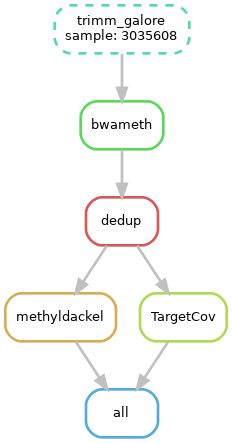

# MethylMappDedupMethyldackelSnakemake

* needs a working conda installation and conda in path

* Snakemake needs to be installed in the working enviroment

* sample.tsv provides a example of the needed sampleseheet

* use the module like this:

```
$ cd methylmappdedupmethyldackelsnakemake
```


```
snakemake --use-conda --cores 8 --conda-prefix "folder where conda should store the envs data (is optional)"

```


* the pipeline creates a folder structure and writes all the output in the parent directory of the current working directory 

#Folder Structure example
```
.
├── 01_raw
├── 02_trimmed
├── 03_mapped
├── 04_MethylDackel
└── methylmappdedupmethyldackelsnakemake
    ├── data
    │   └── all_Gene_and_CpG_ID_annotations_covered_targets_Twist_Methylome_V1_TE-96341190_hg38.bed
    ├── envs
    │   ├── nf.yaml
    │   └── mosdepth.yaml
    ├── samples.tsv
    └── Snakefile
```
# Author
Stephan Drukewitz 


